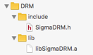

## Prerequire IOS 7.0+
## Integrate with Application

**Import SDK into project:** 


	
**Before initialization player, config acout’s information:**
	
```
[[SigmaDRM getInstance] setClientId:clientId];
[[SigmaDRM getInstance] setAuthToken:authToken];
```

**Integrate with AVPlayer**

```
AVPlayer *_player;
AVPlayerItem *_playerItem;

_playerItem = [AVPlayerItem playerItemWithAsset:[[SigmaDRM getInstance] assetWithUrl: uri]];	
_player = [AVPlayer playerWithPlayerItem:_playerItem];
```