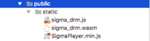

## Prerequire

* **Chrome:** Version 57 or higher
* **Safari:** Version 11 or higher
* **Firefox:** Version 52 or higher
* **MS Edge:** Version 16 or higher
* **Opera:** Version 44 or higher

## Integrate with Application

### Import SDK into project


	
### Integrate SigmaPlayer

```javascript
<video id="player"></video>
<script src="/public/drm/player/SigmaPlayer.min.js"></script>
```

**Before using player, config account’s information**
	

```javascript
const hls = new SigmaManager();

hls.config = {
	enableWorker: true
};

hls.mediaElm = document.getElementById('player');

hls.nativeClient = {
	module: "sigma_drm.js",
	wasmBaseUrl:
		window.location.protocol + "//" +
		window.location.hostname +
		(window.location.port ? ':' +
		window.location.port : '') +
		"/public/drm/", // path to static file
};

hls.appInfo = {
	browser: "Google-Chrome",
	appId: 6,
	"client-id": "clientId"
};
hls.setAuthenToken("token");
```

**Initialization link source**

```javascript
hls.loadSource('link source', {
	method: "sigma"
});
```